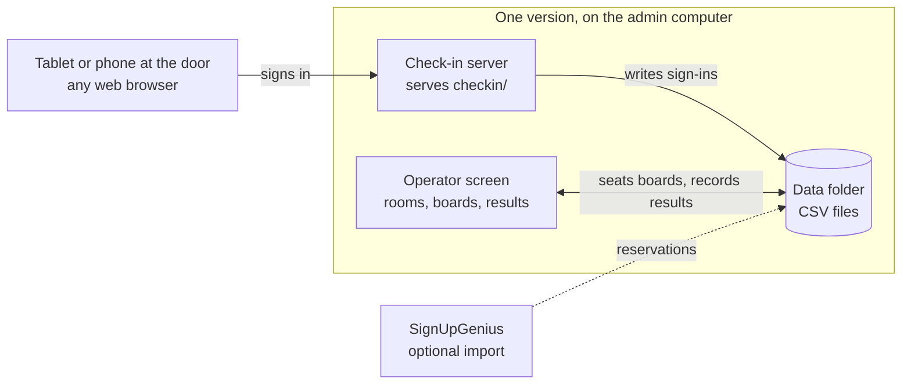
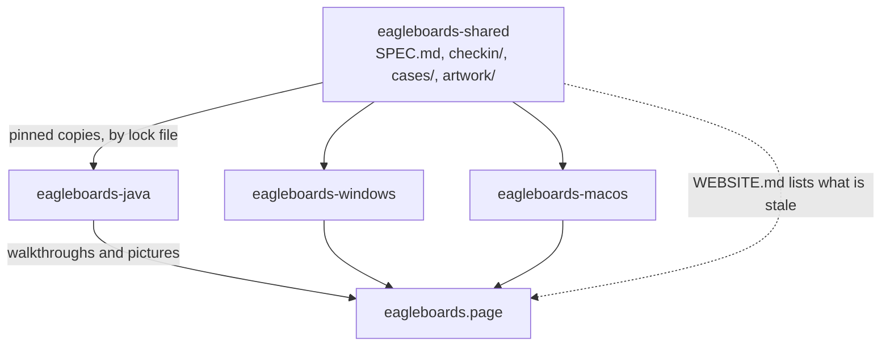

# Eagle Boards: shared

Eagle Boards runs the check-in desk and the rooms at an Eagle Scout board of
review event. Youth and adults sign themselves in on a tablet at the door. The
person running the event puts each youth with a board and a room on one
screen, with the *Guide to Advancement*'s rules checked as the board is built,
and records the result when the board comes out. It runs on one computer at the
venue, needs no internet and no account, and keeps everything in plain files in
a folder.

There are three versions, for Java, Mac and Windows. They serve the same
check-in pages, read and write the same files, and apply the same rules. This
repository is what keeps them that way.

| Java | Mac | Windows |
|:---:|:---:|:---:|
| [](https://eagleboards.page/docs/scheduler/java/) | [](https://eagleboards.page/docs/scheduler/mac/) | [](https://eagleboards.page/docs/scheduler/windows/) |

<sub>The same made-up event in each version, mid-event, in dark mode. The cast
is famous Eagle Scouts; nothing in the pictures is real. The pictures are
hosted on [eagleboards.page](https://eagleboards.page/docs/scheduler/), and each
one links to that version's walkthrough.</sub>

## An event, start to finish

1. **Set up.** Start the program on the admin computer, choose the data folder
   and the event's date, and add the rooms, each marked for final boards or for
   project proposal reviews. Optionally load the event's SignUpGenius
   reservations.
2. **People sign in.** Each person opens the check-in address on a tablet,
   phone or laptop, or scans its QR code. A youth gives a name, an email
   address, a unit and which review they're here for. An adult gives their
   contact details, says whether they can serve as a member or a chair for each
   kind of board, and can count the event toward Wood Badge and name the youth
   they came to support. Anyone who has been before is recognized by email and
   the form fills itself in.
3. **A board is proposed.** Select a waiting youth and the program suggests a
   free room of the right kind, a qualified chair and members. It weighs the
   whole waiting line, so the adults who can chair aren't all spent on the
   first boards. The operator can change anyone, or pick a few people and have
   the program fill in the rest.
4. **Seat, start, complete.** One button for each step. *Seat board* convenes
   the board while the youth waits outside. *Start review* brings the youth in.
   *Complete* records Approved, Adjourned or Not approved, with notes.
   Postponing a youth is a status, never a result.
5. **Every room is timed.** Minutes since the board's last step, with a clock
   that changes when a board runs long or goes overdue.
6. **Afterward.** The results are saved as a CSV report for a spreadsheet, and
   the adults who served are in the history that fills in next month's forms.

## The three versions

The Java version came first. The Mac and Windows versions are native ports of
it, and they read the same data folder, so a unit can move from one to another
between events, or even during one. Don't run two at once against the same
folder.

| | Java | Mac | Windows |
|---|---|---|---|
| **Repository** | [`eagleboards-java`](https://github.com/deekayen/eagleboards-java) | [`eagleboards-macos`](https://github.com/deekayen/eagleboards-macos) | [`eagleboards-windows`](https://github.com/deekayen/eagleboards-windows) |
| **The operator uses** | A web browser, on any computer on the network | A native SwiftUI app | A native WPF app |
| **Runs on** | Windows, macOS or Linux with Java 21 or newer, including a Raspberry Pi | An Apple silicon Mac, macOS 14 or later | Windows 11, or Windows 10 22H2, on a 64-bit Intel or AMD processor |
| **Install** | Java, then one `.jar` | An app dragged to Applications | One self-contained `.exe`, nothing to install |
| **Check-in server** | Jetty | Hummingbird | Kestrel |
| **Operator pages reachable from the network** | Yes | No, the Mac only | No, the admin computer only |
| **Walkthrough** | [eagleboards.page/…/java](https://eagleboards.page/docs/scheduler/java/) | [eagleboards.page/…/mac](https://eagleboards.page/docs/scheduler/mac/) | [eagleboards.page/…/windows](https://eagleboards.page/docs/scheduler/windows/) |

Which to run comes down to the computer you have. A Mac with Apple silicon runs
the Mac version, and a Windows PC runs the Windows version. The Java version
is for an Intel Mac, for Linux, and for a Raspberry Pi with no screen while the
operator works from a laptop on the same network. Each repository's README is
the manual for running an event with that version.

Releases are dated (`v2026.09.28`), and all three publish under the same
scheme on their own GitHub Releases pages.

## What the three have in common

Everything below is decided once, in [`SPEC.md`](SPEC.md), and every version
follows it.

| | Decided as |
|---|---|
| **Data files.** CSV and `config.properties` formats, so a folder opens in any version. A youth's birthdate and phone number are never asked for, kept, shown or exported | D-1, D-7, D-8 |
| **Endpoints.** The Java server's endpoints and wire formats are frozen, because the check-in pages depend on them | D-2 |
| **Board lifecycle.** Registered, Seated, In review, Completed, or Postponed. Only a board that has started can be completed | D-3 |
| **Board rules.** A board of review has three to six members and a project proposal review two to six. The chair is qualified to chair that kind of board and sits on it. Nobody sits on two boards. Adults from the youth's own unit warn, and a board with no one from outside the unit is refused. The server refuses every absolute rule, not only the screen | D-4 |
| **Auto-select.** The same algorithm and the same 70 test cases in all three | D-5, D-12 |
| **A new install starts an empty adult history.** No release ships one, because it would hold participant data | D-9 |
| **The Event page.** The queue, the rooms and the details pane on one page, one status-driven button for the next step, find a person's room, and approved proposals from earlier events | D-10, D-11, D-21, D-22, O-3 |
| **Status colors.** One palette, in light and dark, measured for contrast and for color blindness. Status is always a word or a number with an icon, never color alone | D-13 |
| **Check-in pages.** One set, byte-identical in all three, built to WCAG 2.2 AA | D-18 |
| **Wording.** *Youth* and *event*, on screen and in the check-in pages. The Donate link sits outside the working area, and never on the check-in pages | O-1, D-17 |
| **Undo.** Every board step, room change and link gets Undo | O-2 |

What differs is deliberate, and `SPEC.md` lists it as `P-` items. Each version
follows its own platform's guidelines: the Mac and Windows have a menu bar and
Java doesn't imitate one; the Mac's menus are in Title Case and the other two in
sentence case; the primary action is ⌘↩ on the Mac and Ctrl+Enter elsewhere;
the Mac shows a Dock badge and a notification when a room goes overdue. A
change that makes one version drift toward another where the spec says they
differ is a bug.

### The data folder



The folder holds a `Master_AdultHistory.csv`, which remembers every adult who
has signed in at any event, and one folder per event named by its date, such
as `2026-09-28`. Inside, `scouts.csv` has the youth and their board status,
`adults.csv` the adults, `rooms.csv` the rooms and what is in them, and
`scouts_scheduled.csv` the SignUpGenius reservations, if any were loaded.
`config.properties` holds settings such as the room timer times.

That folder holds names and contact details, some of them about minors. It
never goes into a repository: each repository's `.gitignore` and pre-commit
hook refuse CSV files, dated event folders and API keys.

## The repositories

| Repository | What it holds |
|---|---|
| [`eagleboards-shared`](https://github.com/deekayen/eagleboards-shared) | This one: the spec, the check-in pages, the test cases and the artwork. No application code |
| [`eagleboards-java`](https://github.com/deekayen/eagleboards-java) | The Java version |
| [`eagleboards-windows`](https://github.com/deekayen/eagleboards-windows) | The Windows version |
| [`eagleboards-macos`](https://github.com/deekayen/eagleboards-macos) | The Mac version |
| [`eagleboards.page`](https://github.com/deekayen/eagleboards.page) | The website, [eagleboards.page](https://eagleboards.page/): a guide to running a board of review, with a walkthrough of each version. Hugo with the Docsy theme, published by Cloudflare on every push to `main` |

### What is in this repository

| Path | What |
|---|---|
| [`SPEC.md`](SPEC.md) | What every version must agree on, what each does its own way, what is undecided, and a parity table of where each version stands |
| [`checkin/`](checkin/) | The check-in pages the tablets load, served unchanged by every version, with the API they speak and how each WCAG 2.2 AA criterion is met |
| [`cases/`](cases/) | The board-rule and auto-select test cases, as JSON that every version's tests read |
| [`artwork/`](artwork/) | The app icon, drawn once for all versions, and the Wood Badge mark |
| [`WEBSITE.md`](WEBSITE.md) | What [eagleboards.page](https://eagleboards.page/) shows of each version, which of its pages and pictures are out of date, and how to re-shoot them |
| [`scripts/check-contrast.js`](scripts/check-contrast.js) | Measures every color pair the check-in pages use, light and dark |
| [`scripts/check-palette.js`](scripts/check-palette.js) | Measures the status palette in `SPEC.md` (D-13), light and dark: contrast, and that it holds up for color blindness |
| [`scripts/check-drift.sh`](scripts/check-drift.sh) | Compares each version's copy of the check-in pages, the test cases and the status palette with the ones here |
| [`scripts/gh-coordination.sh`](scripts/gh-coordination.sh) | `gh` helpers for the cross-version issue workflow below |
| [`scripts/java-scene.mjs`](scripts/java-scene.mjs), [`scripts/shoot-java.mjs`](scripts/shoot-java.mjs) | Build the demo event and photograph it, for the website and the READMEs |
| [`scripts/hooks/pre-commit`](scripts/hooks/pre-commit) | Refuses a commit that stages participant data or a secret |

## How the versions are kept in step



1. **The spec leads.** Anything more than one version does is written in
   `SPEC.md` first, and the versions follow it. A change starts as an issue
   here, is settled, and updates the spec and its parity table before any
   version's code changes. The spec's items are numbered and the numbers are
   never reused, so issues and commits can cite them: `D-` for decided, every
   version does this; `P-` for platform-specific by design; `O-` for an open
   question, which the project's owner decides.
2. **Shared files are copied, never linked.** Each platform repository keeps
   its own copy of every shared file it builds with, so a build needs nothing
   outside its own tree. The copies are pinned by a lock file that names a
   commit of this repository (`checkin-pages.lock`, `test-cases.lock`), and
   each version's CI fetches this repository at that commit and fails if a
   copy differs by a single byte. Edit a shared file here, never in a version's
   copy.
3. **Rules are test data.** The board rules and auto-select are written down
   once, as JSON in [`cases/`](cases/). Each version runs every case through
   its own code, so the three can't drift apart without a test failing. A case
   is added here, never in only one version.
4. **One issue, then one per version.** Cross-version work is tracked on the
   [Eagle Boards](https://github.com/users/deekayen/projects/4) GitHub Project.
   A parent issue here settles what to do, and each version that has work gets a
   sub-issue in its own repository. The parent closes when every sub-issue has.
5. **The website follows.** The site describes what the versions do and never
   decides it. When a change alters what the operator or the tablet sees, it
   goes on the Stale list in [`WEBSITE.md`](WEBSITE.md), and the affected
   version is re-shot in one pass once its work has landed.

## Working in these repositories

Clone the four repositories side by side. The scripts here look for their
siblings by name in the parent folder.

```
eagleboards-shared/
eagleboards-java/
eagleboards-windows/
eagleboards-macos/
eagleboards.page/
```

Install the guard hook once per clone:

```sh
git config core.hooksPath scripts/hooks
```

Before changing a shared file, and to see whether the versions still agree,
run the checks. GitHub Actions runs the first two on every push:

```sh
node scripts/check-contrast.js   # the check-in pages, light and dark
node scripts/check-palette.js    # the status palette
scripts/check-drift.sh           # every version's copies, against these
```

Read [`SPEC.md`](SPEC.md) before changing the operator screen, the check-in
pages, the board rules or the data files, in whichever version.

## Rules

- **No participant data.** Test cases here use synthetic people only, stored as
  JSON, never CSV.
- **District-neutral.** No district or council name anywhere.

Eagle Boards is free. If it helps your unit or your district, you can
[support its development](https://eagleboards.page/donate/).

Licensed under the [Apache License 2.0](LICENSE).
